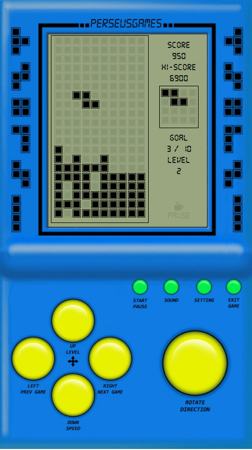

# Tetris-JS
A well-known game implemented in JavaScript (frontend) and Python/Flask (backend). Running version of this game can be found on Heroku: [https://aviatore-tetris.herokuapp.com/](https://aviatore-tetris.herokuapp.com/).

## Screenshot

## Controlls
- left and right arrow keys - horizontal movement
- up arrow key - rotate
- down arrow key - drop pieces faster
- "i" key - pause the game

## Copyright
This is a JavaScript version of the classic Tetris being a part of the awesome [**BrickGame**](https://play.google.com/store/apps/details?id=com.perseusgames.brickgame) - a great compilation of popular console games of the 1990s
 developed by **PerseusGames** on Android devices. I do not own copyright on the original game.